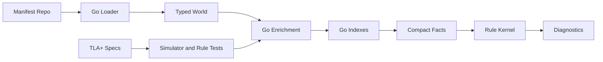

# TLA+ vs Shen for xpc Invariants

## Short Answer

TLA+ is a better fit for **designing and validating temporal models**:
sync waves, prune behavior, ApplicationSet generator shrinkage, cascade
deletion, and "there exists an execution where state is lost" questions.

TLA+ is not a better fit for the production `xpc check` implementation. The
checker needs to parse real YAML, render charts, preserve source locations,
walk OpenAPI schemas, do string/path matching, emit SARIF/JSON/JUnit, and run
quickly in CI. Those are ordinary static-analysis and data-indexing problems,
not model-checking problems.

The best split is:

- **Go**: parse, render, normalize, index, simulate concrete trajectories,
  precompute high-cardinality joins, and emit diagnostics.
- **Rule kernel**: express small predicates over already-normalized facts.
- **TLA+**: specify and model-check the abstract semantics of tricky temporal
  subsystems, then use those specs to validate the Go simulator and rule tests.

## What TLA+ Is Good At Here

TLA+ shines when the question is about all possible state transitions in a
small abstract system.

Good xpc candidates:

- ApplicationSet generator output changes over time.
- Argo CD cascading finalizer semantics.
- `preserveResourcesOnDeletion` and `deletionPolicy: Orphan` interactions.
- Sync-wave and hook-delete-policy order.
- Prune-last behavior.
- Whether a workload can observe a missing ConfigMap, Secret, RoleBinding, or
  Role at any sync step.
- Whether a set of safety guards blocks every INC-6-shaped trace.

Example TLA+ question:

> For every generator shrink trace, if every generated Application either
> preserves resources on deletion or every state-bearing managed resource is
> orphaned, can a state-bearing external object be deleted?

That is exactly the kind of temporal safety property TLA+ is built to explore.
It can find counterexamples in the model before we encode the wrong intuition
in Go or in the kernel.

## What TLA+ Is Bad At Here

Production `xpc` checks are dominated by concrete data:

- YAML and multi-document source files.
- Helm/Kustomize/Crossplane render output.
- AppSet template expansion.
- CRD OpenAPI schema walking.
- JSON pointer and JQ path matching.
- AppProject wildcard semantics.
- Source locations and user-facing fix text.
- CI output formats.
- Large repo performance.

Encoding all of that directly in TLA+ would make the model huge, slow, and hard
to connect back to actionable diagnostics. TLA+ also does not naturally answer:

- "Which line in which YAML file should the author edit?"
- "Which Helm value file failed schema validation?"
- "Which exact AppProject whitelist row is missing?"
- "Can this check run in a few seconds over hundreds of manifests?"

Those are implementation questions for Go and a purpose-built checker.

## What Shen Is Good At Here

Shen has been useful as a compact executable rulebook:

- Pattern matching over normalized facts is terse.
- Rule files are small and reviewable.
- The kernel can emit uniform `judgment` tuples.
- The existing `check-world` dispatch gives stable rule allowlisting and proof
  accounting.

For small predicates, this is fine. Examples:

- R23: deletion policy fact is not `Orphan` and no bypass exists.
- R24: ApplicationSet template has cascading finalizer and preserve is false.
- R25: prod-named AppSet has automated sync.
- R18/R19/R20: renderer result facts contain failure/schema/determinism data.

## Where Shen Was the Wrong Layer

Shen became a poor fit when a rule needed high-cardinality joins:

- `MountRefs x Trajectory x State` for R12.
- `SARefs x RBACBindings x Trajectory x State` for R14.
- `Applications x Resources x CRDs` for R15.
- `Selector/LateInit usages x IgnoreDiffEntries x string path matching` for
  R16/R21.

Those are map/index problems. In a list-oriented kernel they turn into repeated
linear scans and large allocation churn. The current implementation therefore
precomputes compact violation facts in Go and lets Shen convert those facts
into diagnostics.

That split keeps the rule meaning visible while moving the expensive joins to
the language with hash maps and profilers.

## Recommended Architecture

TLA+ should sit beside the implementation as a specification and test oracle
for temporal semantics. It should not replace the checker pipeline.

## When to Add a TLA+ Spec

Add a TLA+ model when a rule involves:

- More than one time step.
- Non-obvious ordering.
- A safety property over all possible event sequences.
- Multiple independent controllers interacting.
- A bug class where a small counterexample would be more valuable than another
  fixture.

Do not add TLA+ for:

- Single-manifest shape checks.
- Schema/type validation.
- String/path matching.
- AppProject whitelist membership.
- Renderer availability or output parsing.

## Concrete Candidates

| Candidate | Why TLA+ Helps | Production Rule |
| --- | --- | --- |
| INC-6 cascade model | Explores generator shrink, Application deletion, finalizers, preserve, and orphan policies across transitions. | R23, R24, R25, `XPC.P.destructive-delete`, `XPC.P.cascade-risk` |
| Sync trajectory model | Validates that the Go simulator's state-after-wave semantics match intended Argo behavior. | R6, R12, R14 |
| Prune-last and hooks | Finds traces where hook-delete-policy or prune-last creates a temporary absence. | R12, R14 |
| Immutable replacement | Models whether a field change implies delete/recreate under provider semantics. | `XPC.P.immutable-change` |

## If We Were Choosing From Scratch

If this project started today, the best production rule substrate probably
would not be raw Shen for every rule. A better implementation shape would be:

- Go for IR, indexes, and high-cardinality joins.
- A small declarative rule layer for low-cardinality predicates.
- Optional Datalog/Rego-style evaluation for facts that genuinely benefit from
  relational syntax.
- TLA+ specs for temporal behavior, not as the runtime engine.

Given the existing codebase, the practical path is incremental:

1. Keep the current kernel contract stable.
2. Move expensive joins into Go facts as needed.
3. Add TLA+ specs for temporal subsystems where model checking adds confidence.
4. Treat the specs as design documentation and regression-test generators.
